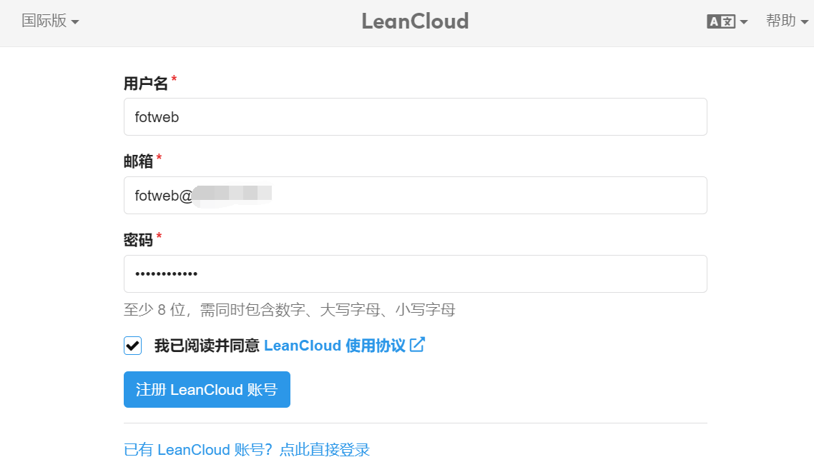
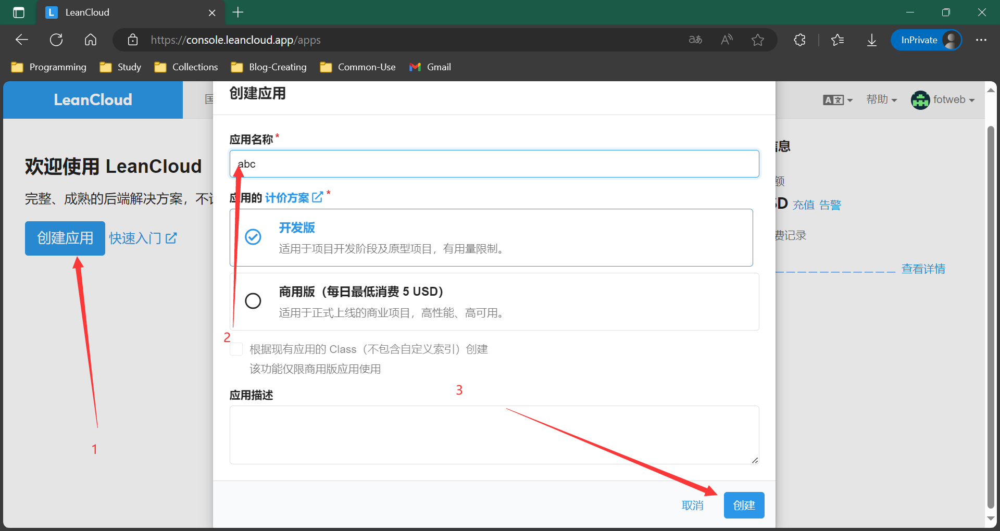
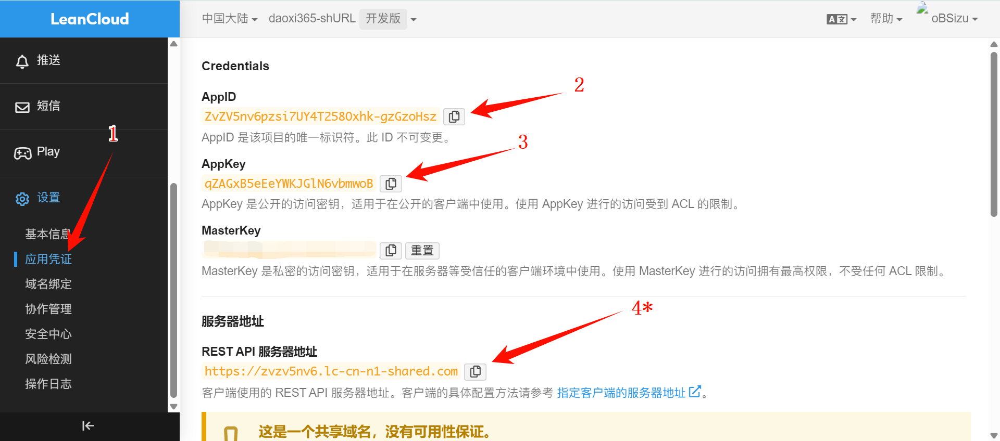
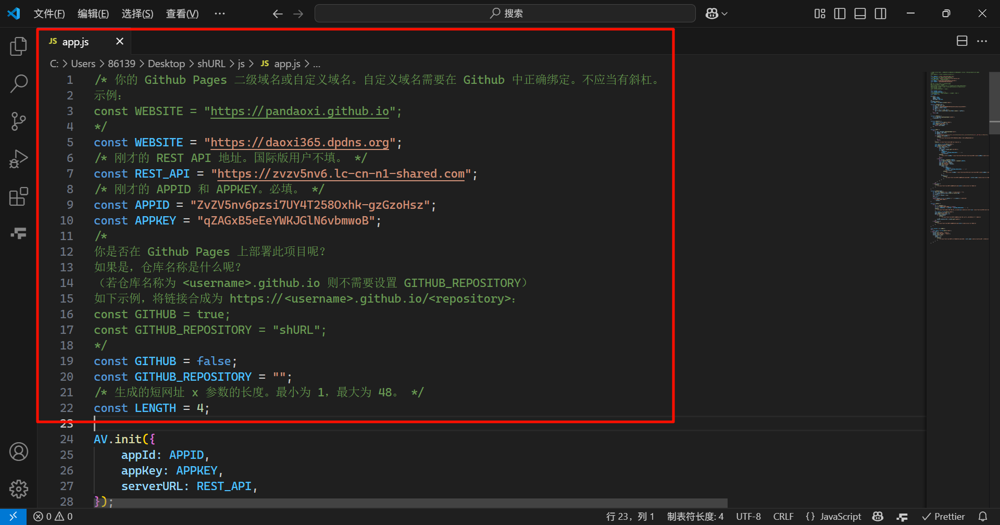
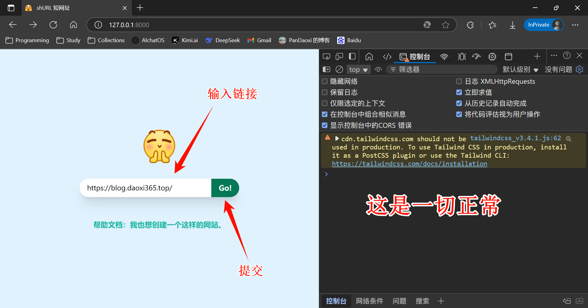
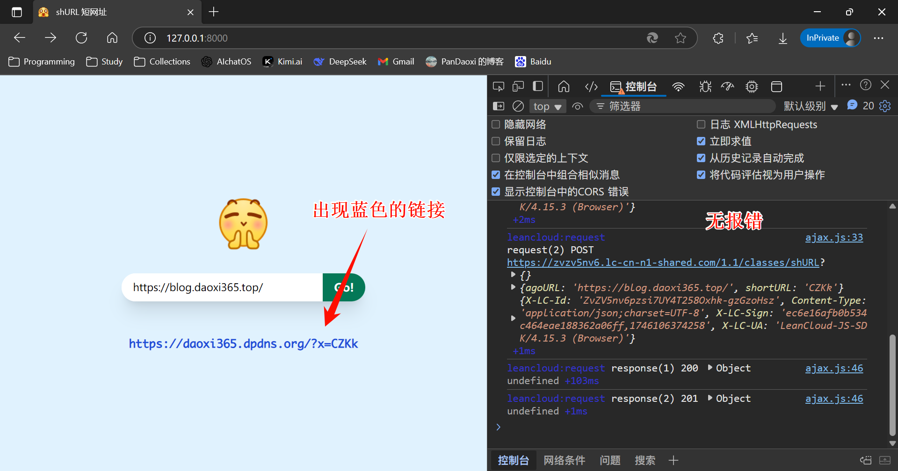
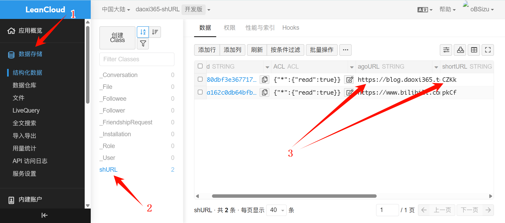
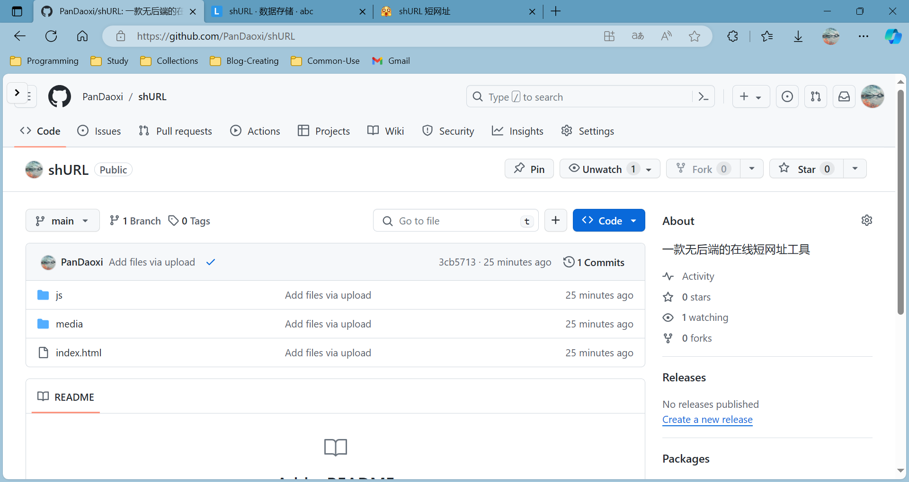
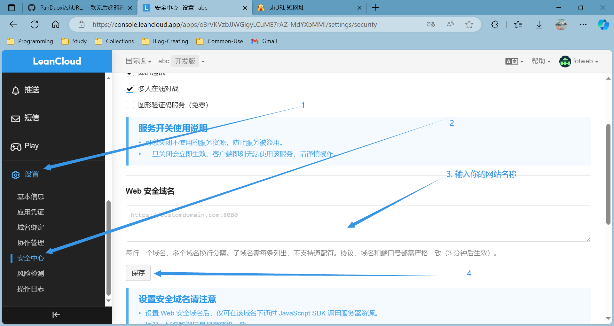

# 「shURL 短网址」

>   欢迎使用 $\texttt{shURL}$！
>   这是 $\texttt{shURL}$ 工具的使用文档。
>
>   [TOC]
>
>   

---

## 综述

此工具为一「短网址」工具。

何为短网址？简单来讲，就是以工具将原网址缩短长度，使访问更加便捷。

举个简单的例子：

原网址：<https://www.bilibili.com/video/BV1DK4y1z7wq/?vd_source=c2c603cbba8a549035c5aaed2e9faa97>
短网址：<https://daoxi365.dpdns.org/?x=pkCf>

显然，它实现链接转换是需要后端服务器、数据库的。但是，此工具选择了基于 LeanCloud 的线上储存，因此可以运行于静态网站，如 `Github Pages`、`Netlify` 等。

## 操作步骤

1.   注册或登录一个 LeanCloud​ 帐号。LeanCloud 账号分为国际、国内两种，如果你使用国外网络环境或用户面向国外，推荐使用**国际版**。反之，则建议使用国内版。
     本网站当前使用国内版 LeanCloud，可大幅提升访问速度。

     

2.   创建一个新应用。应用名称随便写；计价方案选择开发版，否则会被收费。

     

3.   进入刚刚创建的应用，左侧边栏下划到最后，在“设置”中找到“应用凭证”，在右侧按如图方式复制凭证信息。
     注意：第四步  用户必须保留。国际版用户可以不使用此 rest api 地址。

     

4.   打开 `/js/app.js` ，按注释（绿字）要求修改相关内容。

     

5.   本地测试。
     如果有 Python 环境，可以使用以下命令打开一个开发环境：

     ```bat
     python -m http.server 8000
     # 接下来你可以在 127.0.0.1:8000 访问到你的页面。
     ```

     

     

     

6.   关于个性化：

     -   您可以修改 `media` 文件夹下的网站图标（`favicon.ico`）和标志（`logo.png`）。
     -   您可以自行修改网页样式，但是我希望您能保留帮助文档的链接。

7.   push 到远端。打开 pages 服务或用其他平台发布。

     

8.   修改安全网址。

     

9.   测试，完成。

## 补充

您可以在**结构化数据控制台**上增、删短网址。